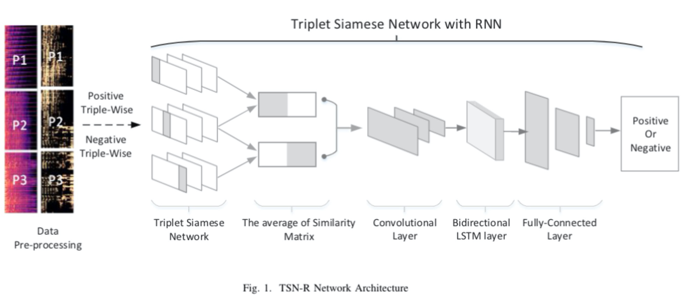
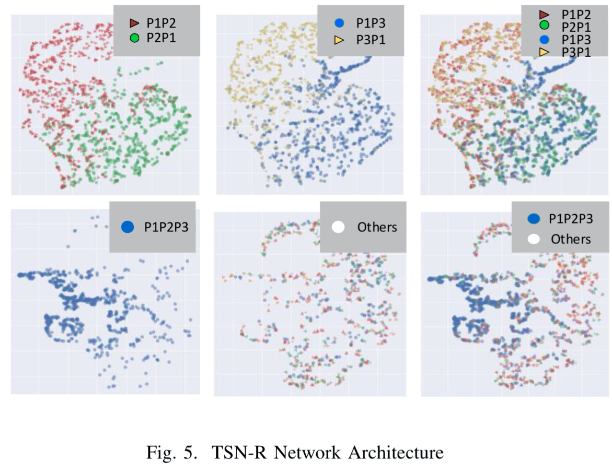

# Diectory   
> source code&nbsp;&nbsp;&nbsp;&nbsp;&nbsp;&nbsp;&nbsp;&nbsp;&nbsp;&nbsp;&nbsp;&nbsp;&nbsp;&nbsp;&nbsp;&nbsp;&nbsp;&nbsp;&nbsp;&nbsp; *.ipynb   
> pre-trained model&nbsp;&nbsp;&nbsp;&nbsp;&nbsp;&nbsp;&nbsp;&nbsp;&nbsp;&nbsp;./model   
> base_line source code&nbsp;&nbsp;&nbsp;&nbsp;./baseline     
   
# File    
>*net.ipynb&nbsp;&nbsp;&nbsp;&nbsp;&nbsp;&nbsp;&nbsp;&nbsp;&nbsp;&nbsp;&nbsp;&nbsp;&nbsp;&nbsp;&nbsp;&nbsp;&nbsp;&nbsp;&nbsp;&nbsp;&nbsp;&nbsp;&nbsp;&nbsp;the netowrok architecture of model   
> *loss.ipynb&nbsp;&nbsp;&nbsp;&nbsp;&nbsp;&nbsp;&nbsp;&nbsp;&nbsp;&nbsp;&nbsp;&nbsp;&nbsp;&nbsp;&nbsp;&nbsp;&nbsp;&nbsp;&nbsp;&nbsp;&nbsp;&nbsp;&nbsp;the loss curves of model   
>*dataloader.ipynb&nbsp;&nbsp;&nbsp;&nbsp;&nbsp;&nbsp;&nbsp;&nbsp;&nbsp;&nbsp;the dataloader of model   
>*testAccuracy.ipynb&nbsp;&nbsp;&nbsp;&nbsp;&nbsp;&nbsp;&nbsp;the accuracy of model conducted on 3-piece fragments
  
# Others
>Different_SongParts_Test.ipynb&nbsp;&nbsp;&nbsp;&nbsp;&nbsp;&nbsp;&nbsp;&nbsp;the accuracy of model conducted on multi-piece fragements    
>Experiment_Visualization.ipynb&nbsp;&nbsp;&nbsp;&nbsp;&nbsp;&nbsp;&nbsp;&nbsp;exact features and 2d-visualization

  
we have presented a novel triplet Siamese network dubbed as triple-wise similarity with recurrent neural network (TSN-R) for learning sequential patterns in a self- supervised way.   
   
we reveal the reasons for the good performance of TSN-R network through the 2d-visualization of features.  